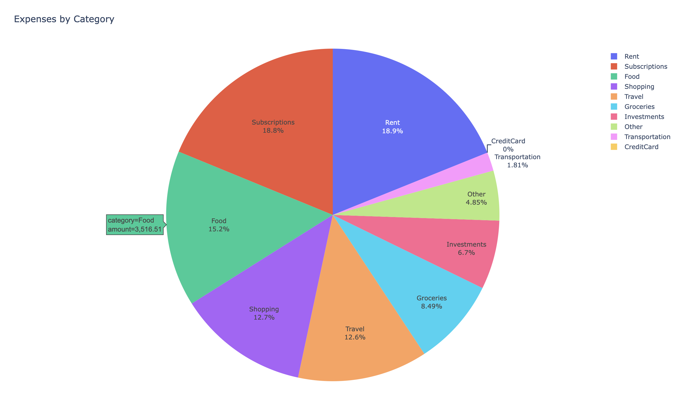

## hdfc-analytics

Get analysis of HDFC bank account and credit card statement

> [!NOTE]  
> Currently only supports bank account statement parsing and analysis

<p align="center"></p>
<div align="center">Expenses by Category</div></br>

### Usage

1. Install CLI
```
pip install https://github.com/vipul-sharma20/hdfc-analytics/releases/download/v0.1.0/hdfc_analytics-0.1.0-py3-none-any.whl
```
(check releases for latest whl releases)

2. Prepare bank statement data. Check the configuration section below

3. Run the CLI
```
hdfc-analytics account --statement-csv=./configs/generated_statement.csv --categories-config=./configs/categories.toml --column-config=./configs/column_mapping.toml
```
Look at [`configs/`][configs] directory for sample configs

### Configuration

Sample set of configurations can be found in [`configs/`][configs] directory.

1. **Statement**: HDFC provides bank statement in XLS format. Download and
   convert your statement to the format as defined in the
   [sample statement][sample-statement]. You'll only need to remove a few rows
   at the top and at the bottom of the generated statement. Clean and save it
   to a csv file
2. **Columns**: This configuration stores custom column names to be mapped for
   the generated sheet columns. Sample config [here][sample-column].
3. **Categories**: This configuration defines some list of strings under a
   category that the script tries to match and categorize each transactions
   into. Sample config [here][sample-categories].

---

> [!WARNING]
> This is an open-source code. While there's no shady business happening in the
> code, I strongly suggest to use this at your own discretion. I strongly
> suggest all users to thoroughly vet and test the code before integration into
> any project or use in a production environment. I offer the code as-is and
> make no representations regarding its correctness, reliability, or safety

[configs]: https://github.com/vipul-sharma20/hdfc-analytics/tree/main/configs
[sample-statement]: https://github.com/vipul-sharma20/hdfc-analytics/blob/main/configs/statement.csv
[sample-column]: https://github.com/vipul-sharma20/hdfc-analytics/blob/main/configs/column_mapping.toml
[sample-categories]: https://github.com/vipul-sharma20/hdfc-analytics/blob/main/configs/categories.toml
